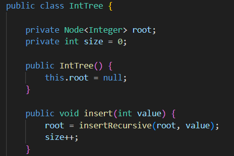

# Práctica: Estructuras No Lineales - 

## Autor
- Nombre: Janelly Dayanna Chacha Velez
- Carrera/Curso: Computacion

##  Nombre de la práctica - Fecha
- Práctica: Práctica de Árboles – Implementación Integers
- Fecha: 2026-01-05

## Descripción
En esta práctica se implementó un Árbol Binario de Búsqueda para enteros.
El árbol permite insertar valores y realizar los recorridos PreOrder, InOrder y PostOrder.
Además, se implementó un método size() con complejidad O(1) utilizando un contador interno que aumenta cada vez que se inserta un nodo.

## Evidencias
### Captura 1

- Y también muestra el tamaño total del árbol, que es calculado en O(1) porque size() solo devuelve el valor del contador interno.

### Captura 2 

- La evidencia muestra:
el atributo private int size;
el incremento del contador dentro de insert()
el método size() que simplemente retorna el contador
Esto demuestra que el tamaño no se calcula recorriendo el árbol, sino leyendo una variable almacenada.